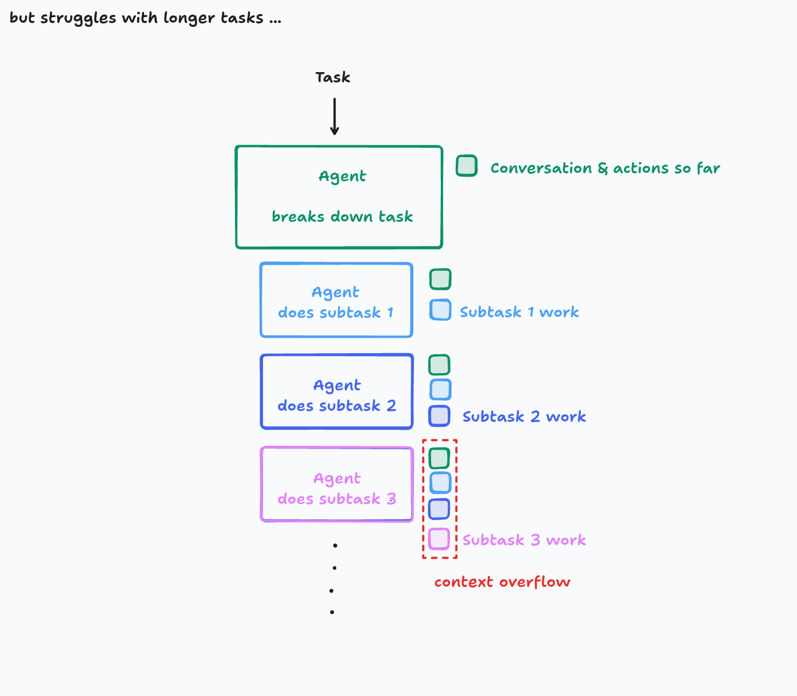
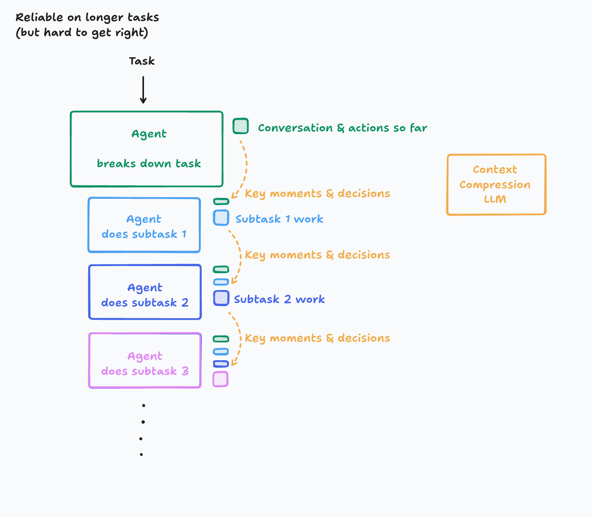

# Writing Reliable Tests for React using AI

A comprehensive guide to building robust test suites with AI assistance

---

## Introduction

https://www.zainfathoni.com/about

---

## AI Usage Principles

- Use AI to **enhance** your productivity
- Be the **pilot**, not the passenger
- Iron Man **suit**, not ~~robot~~ :robot:
- https://x.com/zainfathoni/status/1938256445663023244

---

## Context 🤯

---

## Context 🛠️

---

## Agenda

1. **Prepare React Testing Infrastructure**
2. **Write reliable tests for React components**
3. **Use AI to write the tests**
4. **Prompt AI to produce consistent tests**

---

## 1. Prepare React Testing Infrastructure

- Set up modern testing tools
- Configure testing environment
- Establish best practices
- Create reusable test utilities

---

## 2. Write reliable tests for React components

- Component testing strategies
- Testing user interactions
- Mocking dependencies
- Asserting component behavior

---

## 3. Use AI to write the tests

- Leveraging AI for test generation
- Understanding AI capabilities
- Integrating AI into testing workflow
- Quality assurance with AI-generated tests

---

## 4. Prompt AI to produce consistent tests

- Crafting effective prompts
- Establishing testing patterns
- Creating prompt templates
- Ensuring consistency across tests

---

## Thank You

Questions & Discussion
